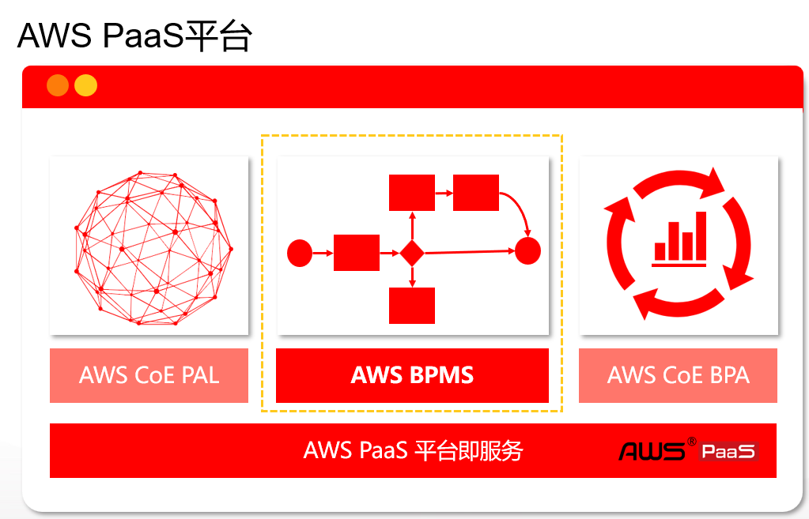

# Day 1

## AWS PaaS 平台

### 本地开发版
[本地实例控制台](http://localhost:8088/portal/console/)  
[本地实例客户端](http://localhost:8088/portal/)  

### 架构
架构分为三层，最底层是AWS平台提供的平台即服务  
第二层为需要搭建的应用  
第三层为实际业务所用的应用  

### 整体应用

### 无代码平台
通过平台提供的流程及模型进行应用构建，实现无代码地构建应用  

### 低代码平台
低代码平台主要处理一些无代码平台流程无法解决的问题  

## 文档 / 链接
[AWS PaaS文档中心](https://docs.awspaas.com/help/index.html)  
[AWS版本环境参考指南](https://docs.awspaas.com/reference-guide/aws-paas-env-guide/index.html)  
[AWS PaaS应用容器与资源控制](https://docs.awspaas.com/reference-guide/aws-paas-container-reference-guide/index.html)  
[AWS BPMN2 Process参考指南](https://docs.awspaas.com/reference-guide/aws-paas-process-reference-guide/index.html)  
[AWS 流程引擎对WCP的支持评估](https://docs.awspaas.com/reference-guide/aws-paas-wcp-reference-guide/index.html)  
[AWS PaaS平台手册](https://docs.awspaas.com/help/usermanual/)
