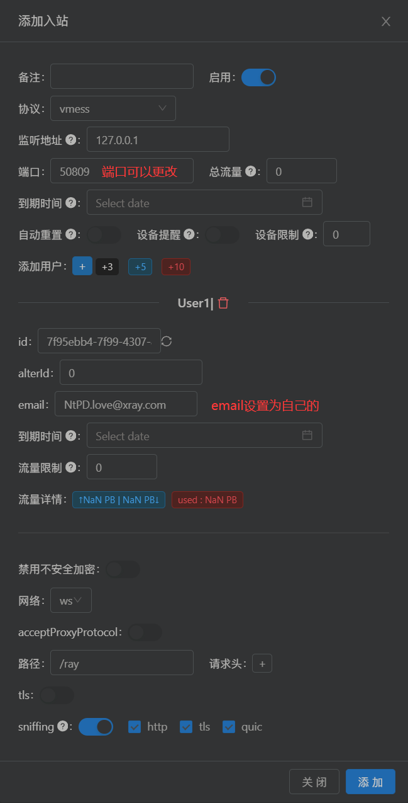
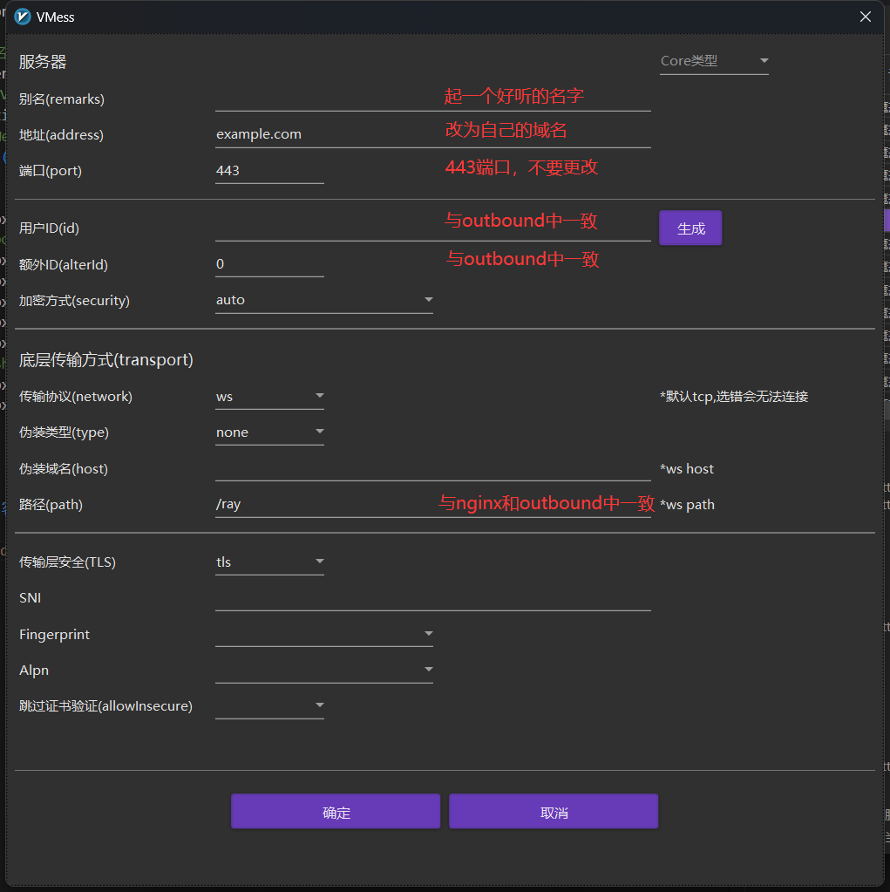

## 一、 安装

### 使用脚本安装

-   安装和更新

    ```sh
    curl -L https://raw.githubusercontent.com/v2fly/fhs-install-v2ray/master/install-release.sh
    ```

-   移除 v2ray

    ```sh
    curl -L https://raw.githubusercontent.com/v2fly/fhs-install-v2ray/master/install-release.sh --remove
    ```

### 使用 GUI 面板安装（X-UI）

-   安装

    ```sh
    curl -Ls https://raw.githubusercontent.com/FranzKafkaYu/x-ui/master/install.sh
    ```

-   安装完成后，直接输入`x-ui`命令即可进入控制菜单，菜单内容：

    ```
      x-ui 面板管理脚本
      0. 退出脚本
    ————————————————
      1. 安装 x-ui
      2. 更新 x-ui
      3. 卸载 x-ui
    ————————————————
      4. 重置用户名密码
      5. 重置面板设置
      6. 设置面板端口
      7. 查看当前面板设置
    ————————————————
      8. 启动 x-ui
      9. 停止 x-ui
      10. 重启 x-ui
      11. 查看 x-ui 状态
      12. 查看 x-ui 日志
    ————————————————
      13. 设置 x-ui 开机自启
      14. 取消 x-ui 开机自启
    ————————————————
      15. 一键安装 bbr (最新内核)
      16. 一键申请SSL证书(acme申请)

    面板状态: 已运行
    是否开机自启: 是
    xray 状态: 运行

    请输入选择 [0-16]:
    ```

## 二、 配置 WebSocket + TLS + Web

### 1. 服务端配置

-   脚本安装

    ```json
    {
        "inbounds": [
            {
                "port": 10000,
                "listen": "127.0.0.1",
                "protocol": "vmess",
                "settings": {
                    "clients": [
                        {
                            "id": "b831381d-6324-4d53-ad4f-8cda48b30811",
                            "alterId": 0
                        }
                    ]
                },
                "streamSettings": {
                    "network": "ws",
                    "wsSettings": {
                        "path": "/ray"
                    }
                }
            }
        ],
        "outbounds": [
            {
                "protocol": "freedom",
                "settings": {}
            }
        ]
    }
    ```

-   X-UI 安装  
    

### 2. 签发证书

使用`acme.sh`签发，另请参阅[acme.sh 说明](https://github.com/acmesh-official/acme.sh/wiki/%E8%AF%B4%E6%98%8E)

### 3. 配置 Nginx

```conf
server {
  listen 443 ssl;
  listen [::]:443 ssl;

  # SSL 证书，更改为自己的证书保存位置
  ssl_certificate       /etc/v2ray/v2ray.crt;
  ssl_certificate_key   /etc/v2ray/v2ray.key;
  ssl_session_timeout 1d;
  ssl_session_cache shared:MozSSL:10m;
  ssl_session_tickets off;

  ssl_protocols         TLSv1.2 TLSv1.3;
  ssl_ciphers           ECDHE-ECDSA-AES128-GCM-SHA256:ECDHE-RSA-AES128-GCM-SHA256:ECDHE-ECDSA-AES256-GCM-SHA384:ECDHE-RSA-AES256-GCM-SHA384:ECDHE-ECDSA-CHACHA20-POLY1305:ECDHE-RSA-CHACHA20-POLY1305:DHE-RSA-AES128-GCM-SHA256:DHE-RSA-AES256-GCM-SHA384;
  ssl_prefer_server_ciphers off;

  # 域名更改为自己的域名
  server_name           example.com;
  # 与 V2Ray 配置中的 path 保持一致，默认情况下不需要改
  location /ray {
    # WebSocket协商失败时返回404
    if ($http_upgrade != "websocket") {
        return 404;
    }
    proxy_redirect off;
    # port改成配置的端口
    proxy_pass http://127.0.0.1:port;
    proxy_http_version 1.1;
    proxy_set_header Upgrade $http_upgrade;
    proxy_set_header Connection "upgrade";
    proxy_set_header Host $host;
    # Show real IP in v2ray access.log
    proxy_set_header X-Real-IP $remote_addr;
    proxy_set_header X-Forwarded-For $proxy_add_x_forwarded_for;
  }
}
```

### 4. 客户端配置

-   以 `Windows v2rayN` 为例,配置如下：
    

-   如果只使用内核，则配置文件如下：

    ```json
    {
        "inbounds": [
            {
                "port": 1080,
                "listen": "127.0.0.1",
                "protocol": "socks",
                "sniffing": {
                    "enabled": true,
                    "destOverride": ["http", "tls"]
                },
                "settings": {
                    "auth": "noauth",
                    "udp": false
                }
            }
        ],
        "outbounds": [
            {
                "protocol": "vmess",
                "settings": {
                    "vnext": [
                        {
                            "address": "example.com",
                            "port": 443,
                            "users": [
                                {
                                    "id": "b831381d-6324-4d53-ad4f-8cda48b30811",
                                    "alterId": 0
                                }
                            ]
                        }
                    ]
                },
                "streamSettings": {
                    "network": "ws",
                    "security": "tls",
                    "wsSettings": {
                        "path": "/ray"
                    }
                }
            }
        ]
    }
    ```
